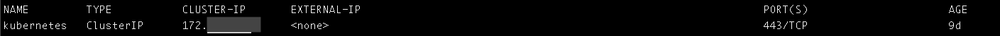

# Integrating 1Password with Azure Active Directory using Kubernetes

This post gives you a basic guide for integrating Azure AD with your 1Password Business to automate 1Password user management based on your AD. Integration requires deploying service called [SCIM](http://www.simplecloud.info) bridge, which basically ensures integration of Azure AD with 1Password using SCIM v2 standard (well, apparently that's why it's called bridge). Basic requirements and short tutorial of setup is provided [here on 1Password's site](https://support.1password.com/scim-azure-ad/) so this post will be more like a summary of all the other actions involved to ensure the integration service running. This is more kind of summary about the first experience with the Kubernetes.

As you may find it out in 1Password [SCIM examples repository](https://github.com/1Password/scim-examples/) there are various options to host the service - Docker, Docker Swarm, AWS Terraform and Kubernetes. From these all we have chosen to host the service on a Kubernetes cluster in [Amazon EKS](https://aws.amazon.com/eks/) due to the future plans using this platform for other our projects. I guess it's more traditional to host [Kubernetes](https://kubernetes.io/docs/concepts/overview/what-is-kubernetes/) clusters in a GCP (Google Cloud Platform) but we have chosen the AWS over the GCP just because we are already hosting many parts of our infrastructure in the AWS and it seemed more convenient to stick to the same platform for now. However the Kubernetes hosting (container hosting in general) is a new experience for us and that's why it felt quite important to document somewhere the first-time experience.

## 1. Create the Kubernetes cluster in Amazon EKS

Assuming that you have the AWS account up & running, a good starting point might be [this getting started guide](https://docs.aws.amazon.com/eks/latest/userguide/getting-started.html). 

As you may find out by the AWS guide the cluster requires the following resources to be created:
- VPC (virtual network for hosting EC2 instances)
- Subnets (min 2 subnets in different zones to ensure better availablity)
- Security Group (to ensure cluster controller has proper access to the nodes)
You may provision all of these resources by deploying CloudFormation template found in the AWS guide or reuse some which you already have (e.g. we have used our main VPC we're using for most of our services in AWS). Having all these resources created you can now create the EKS cluster by filling out "Create cluster" form by selecting appropriate resources you have just created.

## 2. Configure `kubectl` CLI on your local computer

This is a Kubernetes CLI application you have to install and configure to interact with your Kubernetes cluster. AWS provides special `update-kubeconfig` from the AWS CLI to generate kubeconfig file for the Kubernetes CLI. Just follow [the Step 2 of the AWS guide](https://docs.aws.amazon.com/eks/latest/userguide/getting-started.html#eks-configure-kubectl) to get it up & running on your computer. When you have successfully done that you should be able to see that status of your newly created cluster by running `kubectl get svc`.

## 3. Launch the Amazon EKS worker nodes and link them to the Kubernetes cluster

To be able actually running any service in your already *running* cluster you have to launch or provision worker nodes (AWS EC2 instances basically) which are linked to the cluster. Again, it's very simple to accomplish this task by just following the [Step 3 of the AWS guide](https://docs.aws.amazon.com/eks/latest/userguide/getting-started.html#eks-launch-workers) and deploying the pre-defined CloudFormation template. You just have to specify your preferred template input parameters. The most important here is to understand how large and what type of cluster infrastructure will you need to run your services in a cluster. For our 1Password SCIM service we need neither any high-performance instances (we have chosen *t3.medium*) nor wide scaling limits (we went with max 2 instances for an auto-scaling group). When the nodes are deployed, you just have to join them to your cluster from the Kubernetes CLI (see the AWS guide). You can now see the status of the nodes by running `kubectl get nodes`.

## 4. Deploy the 1Password SCIM bridge service

Now, when all hosting infrastructure up & running you can deploy the SCIM service into it. At this point it's time to switch to another nice [tutorial from 1Password](https://github.com/1Password/scim-examples/tree/master/kubernetes) which consists of 3 basic steps:
1. Deploy the redis service to ensure data caching for the SCIM service.
2. Generate OAuth bearer token (`scimsession`) which will be used to authenticate your AD client application.
3. Deploy the SCIM bridge.

When both services are successfully deployed you should be able to see them by running `kubectl get svc`. You can notice that there has been also `LoadBalancer` service deployed which will let us accessing the cluster from the external network.

## 5. Configure DNS for the external access of the cluster

As just mentioned we have now load balancer running which has public ip exposed (well it's actually public hostname generated by AWS). You can use this public hostname to register your own custom CNAME record in your DNS registrar to have an easy to read & remember address for the SCIM service endpoint e.g. https://1password-scim.example.com.

## 6. Integrate the SCIM bridge service with Azure Active Directory

Finally when you have the scim service up & running you can configure your Azure AD to automatically send sync data to it. Also for this task there is available rather nice [guide by 1Password](https://support.1password.com/scim-azure-ad/). You will need Azure AD Premium (at least P1) purchased for your Azure account to be able creating custom enterprise applications in your Azure AD. The good news is that Azure AD Premium [pricing plans](https://azure.microsoft.com/en-us/pricing/details/active-directory/) are user-based and you should be fine with just one user having P1 plan subscribed to be able creating the enterprise app. So you can enable this feature in Azure for just 5 EUR / month with Azure AD P1.
From configuration perspective it's rather nice that for the enterprise app you can say that you want only "assigned users and groups" be provisioned to the SCIM servce. This allows you to filter out only those security groups from your AD which are relevant for syncing with AD (e.g. Developers, Project Managers) and avoid syncing of, let's say, some service accounts.

# Conclusions

I'd say the setup of this entire thing in general took a bit longer than I planned, but still it was worth it because of the automation benefits we achieved and also because of the new things I have learned about the entire containers-based hosting approach and hosting Kubernetes platform.

## Benefits

Speaking of the benefits. In the enterprise environment there are often multiple sets of services and assets which employees of certain jobs and positions should or should not have access to and user administrator have to deal with granting or disabling these permissions quite often. You have to deal with it whenever the new employee comes to your company (register all the accounts, grant access), whenever somebody leaves your company (revoke the access) or also when user is changing the teams inside the company (change set of permissions). So the more employees you get the more users you have to manage and the more authorized services you run the more permissions you have to manage. At the end of the day it can turn out very busy job for you as a user account administrator and things can get really messy and inconsistent if you try to manage these accounts in each of those services independently. I bet everyone has ever found a user account in some service for an employees which have been retired from your company for several months or even longer time already. It has just been forgotten to be deleted by someone responsible for it in the company. That's just a trivial scenario which would not happen if the user authentication/authorization was integrated with AD assuming that AD is that major thing you always remember to take care of when employee leaves the company. This is why in many cases it's good to consolidate this logic/rules into one authoritative or centralized service (AD in our case) and integrate the relevant services with it as far as possible to secure our systems & services better and simplier. And obviously you can't overestimate the value of having well organized and consistent user management for such thing as your company's password and secrets storage (1Password is in this case).

## User creation process

I would like to mention also one nice touch in the user creation process what this particular setup ensures. It's about the situation when you have to create, let's say, new AD user for someone joining your company and have to set an original AD password for it. Traditionally you would probably create an AD user and all the relevant accounts for the new person a day or few before the person starts in the company. The question is - where do you keep the orginal account passwords and how do you ultimately shared them with the person. Sending as a unencripted email is not secure. Storing it in your own password manager and sharing it with the person later is a bit destructing process. So the described setup provides quite a nice process to mitigate this problem.

1. _Manually_ create a new login item for the new AD user in your 1Password vault and generate a secure password for it.
2. _Manually_ create an AD user and use the generated password as original password from the 1Password (which later will have to be reset obviously).
3. _Automatically_ AD user gets provisioned into your 1Password account and the 1Password invitation is sent to the person's email specified in an AD.
4. _Automatically_ private vault gets created in 1Password for the user and is available *only* to the 1Password provision administrators as long as invited user hasn't completed the account registration.
5. _Manually_ move the new persons's relevenat login items and passwords from your 1password private vault into his/her private vault.
6. _Automatically_ user's private vault gets attached to his/her 1Password user when the person starts in your company and completes the account registration. Nobody but user itself has access to the private vault from now on.

So I found this process pretty cool because it's a secure way of sharing passwords and at the same time it makes my work process kind of straightforward and requires my (admin's) attention only once when I'm creating all the original users and accounts. Later when the employee comes to the company on the first day, he/she must be able to proceed further with all the on-boarding things himself starting with the 1Password invitation in the mailbox.

## Containers and the Kubernetes

Based on my little experience of working with containers it has proven to be a surprisingly simple to set up & run technology. I start to appreaciate it more & more in the situations like this when there are given instructions you have to follow to run some sort of service with many components already pre-configured. It is pretty much just as simple as reading through the post (or several posts) and repeating the neccessary CLI commands in your terminal. So that's really easy and cool experience. 
Well, obviously things start to get more complicated when you try to understand how the services are actually configured and need to customize something to meet your specific requirements. In this case there was no trivial step-by-step guide for hosting the SCIM bridge service in a Kubernetes in AWS (Amazon EKS). So it took a bit longer time to investigate how actually worker nodes are being linked to already running cluster in an AWS. I guess the reason of this little confusion was because of missing GUI in AWS for managing Kubernetes worked nodes & services. You have to get used that the only thing you can see from the AWS GUI console is the status of the Kubernetes cluster (and some network infrastructure linked to it) but everything else can be accessed / configured / managed via the `kubectl` Kubernetes CLI. So when you get that it's also very easy and convenient to follow all the guides and examples for setting up required infrastructure. Things get even easier when you have all the needed resources defined in AWS CloudFormation templates (Amazon's infrastructure-as-code format). 
