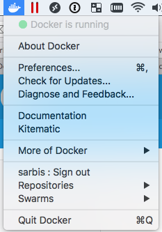
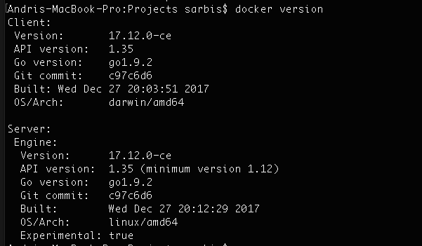
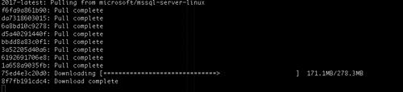
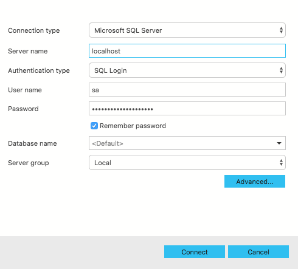
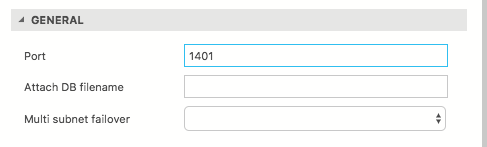
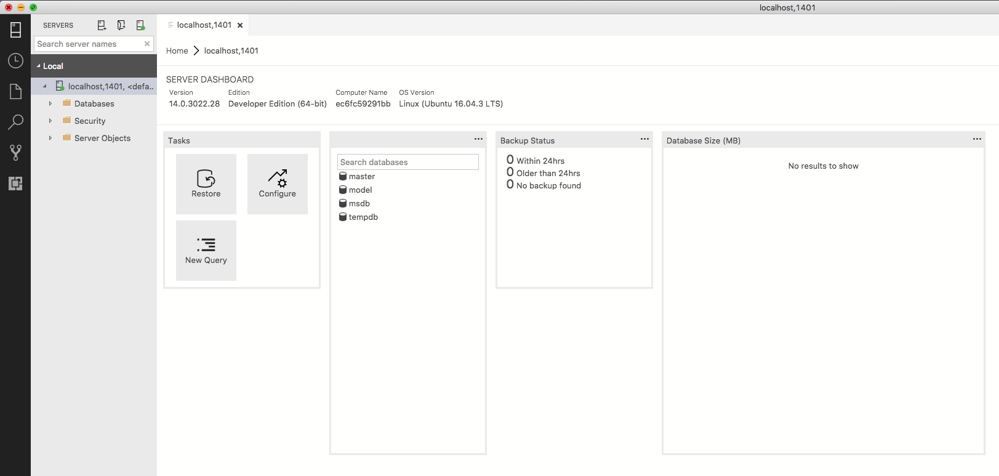
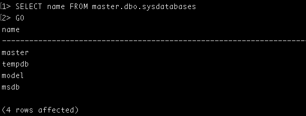

# Setting up SQL server on Docker in Mac OS

## A short background

### Why Mac OS?

I'm a web developer & CI/CD process administrator in my everyday work in Geta. I have Mac OS as my host OS for many years now and I really enjoy the benefits what I get using devices in so called "Mac ecosystem". Won't go in more details about it this time but that is why I'm writing about Docker in Mac OS.

### Why SQL Server?

Our company's core business is to produce web applications & services built on .NET platform and obviously SQL Server is most common database engine choice in this context because it fits well with .NET applications. This means that pretty much every developer in our company has to run local SQL Server instance for local development purposes on their computers. And obviously there haven't been easy solutions to run SQL Server natively on Mac OS, which requires me to run it on Windows hosted on Parallels Desktop VM, which in turn makes me sacrifice some host OS resources. As I mentioned, I take it in favor of having some other benefits of working on Mac OS. :)

### Why Docker?

Docker / containers / microservices has been a buzz words to me (from sessions in conferences, different blog posts, buddy in the company who have had hands-on experience with Docker - [Klavs Prieditis](https://prieditis.lv)) for a several years, but I never managed to discover these things more. And then few weeks ago somewhere on the Internet :) I ran into this MSDN post about [running SQL Server 2017 container with Docker](https://docs.microsoft.com/en-us/sql/linux/quickstart-install-connect-docker) which reminded me that would be nice to test these things. Finally the last thing which nailed it all was a message from another workmate in Geta [Valdis Iljuconoks](https://blog.tech-fellow.net) about the new lightweight [SQL tool by Microsoft](https://github.com/Microsoft/sqlopsstudio) which can be run natively on Mac OS. 

So these are basically the reasons why I felt it was right time for me to try all these pieces stiching together and to see if I could get more freedom of Windows & Parallels Desktop. Turned out it was easy to set up everything -> it is easy to use -> it performs much faster than on Parallels VM -> I'm happy -> I want to tell about this to others! :)

## Problem 

As I mentioned before I am dependant on Parallels Desktop VM to run SQL Server local instance. That means I have to start my Windows VM every time I need to access some local database which takes some time obviously as well as running software on VM is not as resource-efficient as running similar software on native OS.

Besides that SQL Server Management Studio (which I used before to connect to my local SQL databases) alone is a rather heavy piece of software, which is often more than you need to do a basic tasks with SQL Server e.g. run basic table queries, create new users, grant permissions etc.

## Solution

### 1. Install Docker engine (Docker for Mac in my case)

That's a rather straightforward installation process, just follow the [installation instructions on Docker site](https://docs.docker.com/docker-for-mac/install/). When you have completed installation you must have Docker whale icon visible in Mac OS menu bar.



You can verify that Docker CLI is also successfully installed by running `docker version` command.



### 2. Pull & Run SQL Server Docker container image 

Again, this is also very simple (even without any previous Docker knowledge) if you follow [the MSDN post](https://docs.microsoft.com/en-us/sql/linux/quickstart-install-connect-docker). 

1. Pull the SQL Server image from Docker Hub. 
   
   I was totally fine with the latest SQL version so I went with that. 

   ```bash
   sudo docker pull microsoft/mssql-server-linux:2017-latest
   ```
   Btw, really sweet progress bar for Docker CLI. :)

   

2. Run container image on your Docker engine.

   I did some parameter value adjustments in the `docker run` comand (e.g. container name, SQL password) and also added shared folder mapping option my from host OS. It's good to have shared folder mapped when you would like to transfer some files into docker container. In my case I realized that I need it for copying db backup file and later restoring a db from it.

   ```bash
   docker run \
   --name sarbis-mac-sql \
   --volume /Users/sarbis/Desktop/DockerShared:/HostShared \
   --env 'ACCEPT_EULA=Y' \
   --env 'MSSQL_SA_PASSWORD=password' \
   --publish 1401:1433 \
   --detach microsoft/mssql-server-linux:2017-latest
   ```

### 3. Connect to a Docker SQL Server from your preferred SQL tool

#### SQL Operations Studio

As I wrote before one of the main reasons of my excitement about this all was release of [SQL Operations Studio for Mac OS](https://docs.microsoft.com/en-us/sql/sql-operations-studio/download) which is a free SQL Server tool that runs natively on Mac OS. I find it very good for doing basic everyday tasks (from web developer perspective) because of simplicity and having GUI. 

Before SQL Operations Studio I was sometimes using also [mssql extension for VS Code](https://marketplace.visualstudio.com/items?itemName=ms-mssql.mssql) which runs natively on Mac OS but in comparison lacks nicer GUI for switching databases and SQL servers, restoring databases. Nevertheless it can be handy if you don't have to work with SQL Server often and not with many different servers and databases. I feel like SQL Operations Studio is a nice alternative for me between comprehensive SQL Server Management Studio and VS Code in terms of simplicity and functionality features.

So now you can connect to the local SQL Server instance running on Docker by specifying a server name (_localhost_) and a port number (_1401_) what you specified in the `docker run` command previously.



Woohoo! You are finally connected to SQL Server instance running on Mac Docker container and using SQL tool running natively on Mac OS too. :)



You can now either create new db from script or restore it by first copying backup file into mapped Docker folder and then selecting the db backup file in Restore dialog of SQL Operations Studio.

#### SQL Server Command Line Tools

Just wanted to note that there is also [SQL Server Command Line Tools for Mac](https://blogs.technet.microsoft.com/dataplatforminsider/2017/04/03/sql-server-command-line-tools-for-mac-preview-now-available/) which is another relatively new SQL tool from Microsoft which is now available for Mac OS natively (in preview version though). It is yet another evidence that .NET stack developers are slowly "set free" of having to use Windows.

_sqlcmd_ can be installed via the [Homebrew](https://brew.sh) package manager which (as many Mac users probably already know) is really handy tool for easy ~~beer brewing~~ installation of various applications from Terminal.

At first link the _sqlcmd_ git repository with `brew tap` command.
```bash
brew tap microsoft/mssql-preview https://github.com/Microsoft/homebrew-mssql-preview`
```

Then simply install the software with `brew install`.
```bash
brew install –no-sandbox msodbcsql mssql-tools
```

Now you can connect to your SQL Server with _sqlcmd_ command line utility from Mac OS Terminal.
```bash
sqlcmd -S localhost,1401 -U sa -P password
```

And even run a SQL query! :)



## Summary

To wrap this up I could say that with rather small effort it is possible to set up OS-independent SQL Server instance, which can be easily stopped, transferred to other environment, ran together with other versions / instances of SQL server etc. That gives a lot of flexibility and makes life much easier for many developers (especially those who are on Mac OS). And now it is even easier life for Mac OS people when there is sufficient SQL tool which is free and can run natively on their OS.