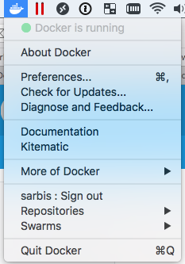
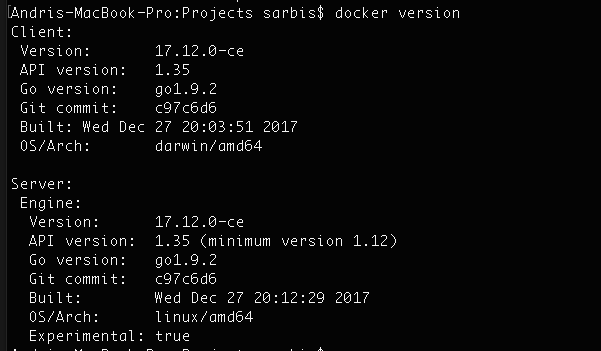
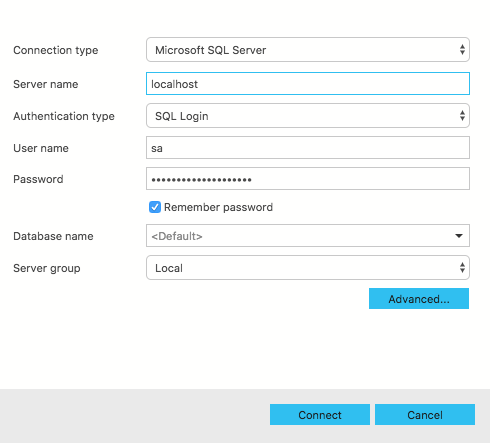
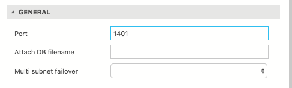
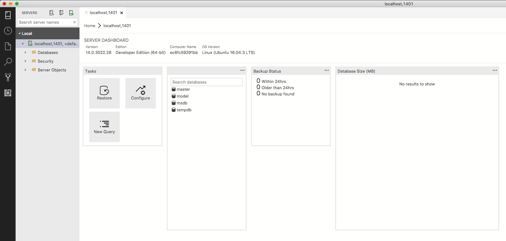

# Setting up SQL server development environment on Mac OS & Docker

## TLDR

It super easy and convenient to run a desired version of SQL Server in an isolated environment using Docker containers.

## A little background

Why Mac OS?

Why SQL Server?

Why Docker? Docker noob.

Why just now?

## The problem 

Dependant on Parallels VM. Takes long time to start up. Running app on VM is not as resource-efficient as running app on native OS.

SSMS (SQL Server Management Studio) very comprehensive tool, but often too heavy to do a basic stuff e.g. run basic table queries, create new users, grant permissions etc.

## Steps

### 1. Install Docker engine (Docker for Mac in my case)

Pretty straightforward installation process, just follow the [installation instructions on Docker site](https://docs.docker.com/docker-for-mac/install/). When you have completed installation you must have Docker whale icon visible in Mac OS menu bar.



You can verify that Docker CLI is also successfully installed by running `docker version` command.



### 2. Pull & Run SQL Server Docker container image 

Again, this is also very simple (even without any previous Docker knowledge) if you follow [the MSDN post](https://docs.microsoft.com/en-us/sql/linux/quickstart-install-connect-docker). 

1. Pull the SQL Server image from Docker Hub. 
   
   I was totally fine with the latest SQL version so I went with that. 

   ```bash
   sudo docker pull microsoft/mssql-server-linux:2017-latest
   ```
   Btw, really sweet progress bar for Docker CLI. :)
   

2. Run container image on your Docker engine.

   I did some parameter value adjustments in the `docker run` comand (e.g. container name, SQL password) and also added shared folder mapping option my from host OS. It's good to have shared folder mapped when you would like to transfer some files into docker container. In my case I realized that I need it for copying db backup file and later restoring a db from it.

   ```bash
   docker run \
   --name sarbis-mac-sql \
   --volume /Users/sarbis/Desktop/DockerShared:/HostShared \
   --env 'ACCEPT_EULA=Y' \
   --env 'MSSQL_SA_PASSWORD=PokKfkk22fdT6Nuwp3bR' \
   --publish 1401:1433 \
   --detach microsoft/mssql-server-linux:2017-latest
   ```

### 3. Connect to a Docker SQL Server from your desired SQL tool

As I wrote before one of the main reasons of my excitement was the [SQL Operations Studio for macOS](https://docs.microsoft.com/en-us/sql/sql-operations-studio/download) which is a free SQL Server tool that runs natively on Mac OS. I find it very good for doing basic everyday tasks (from web developer perspective) because of simplicity and having GUI. 

Before SQL Operations Studio I was using also [mssql extension for VS Code](https://marketplace.visualstudio.com/items?itemName=ms-mssql.mssql) which in comparison lacks nicer GUI for switching databases and SQL servers but nevertheless can be handy if you don't have to work often and with many different servers and databases in SQL Server. I feel like SQL Operations Studio is a nice alternative for me between comprehensive SQL Server Management Studio and VS Code in terms of provided functionality.

So now we can connect to local SQL Server instance running on Docker by specifying localhost and port number what we specified in our `docker run` command.



Woohoo! We are finally connected to SQL Server instance running on Mac Docker container and using SQL tool running natively on Mac OS too. :)



Now you can create new db from script or restore it by first copying backup file into mapped Docker folder and then restoring db from the backup file with SQL Operations Studio.

## Summary

With small effort it is possible to set up OS independent SQL Server instance, which can be easily stopped, transferred to other computer, run in parallel with other versions / instances of SQL server. That can make life much easier for many developers (especially who's host OS is Mac OS). And it is even nicer for Mac people when there is appropriate SQL tool which is free and can run natively on your OS.